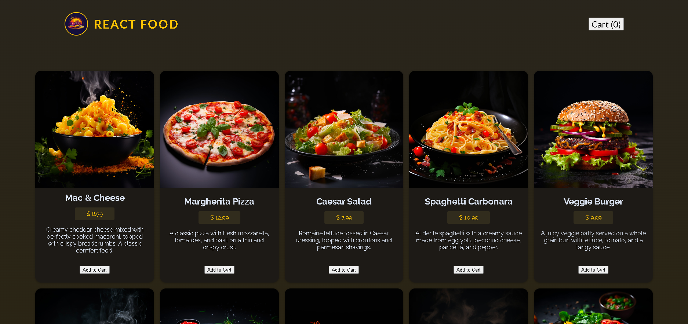
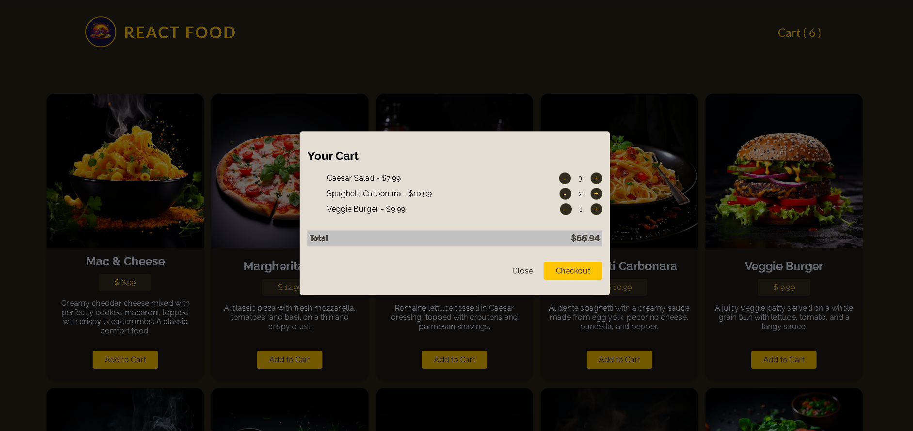
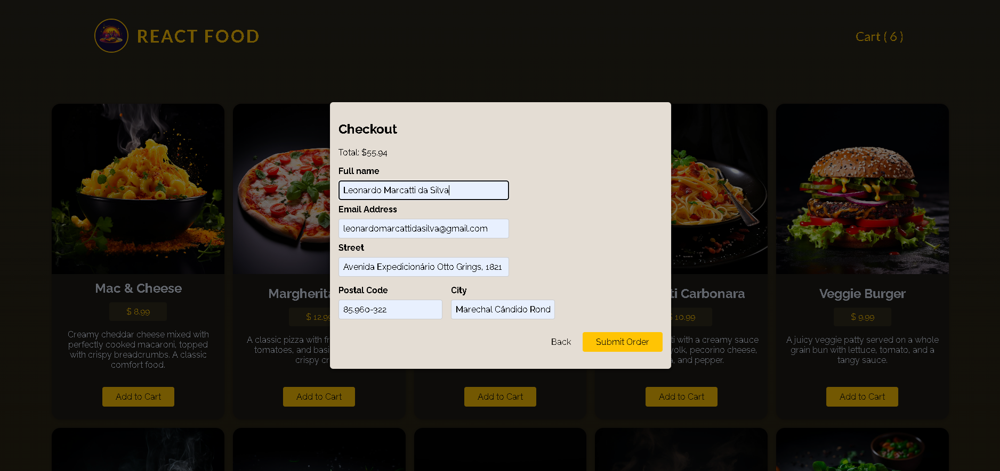
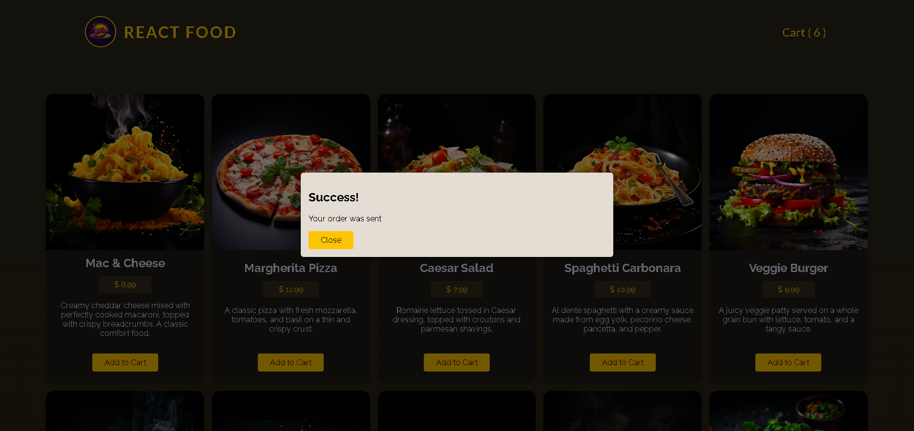

<h1>🍔 Food Delivery App</h1>

Uma aplicação fullstack de delivery de comida construída com React + Node.js e executada em containers Docker.

<ul>
   <li>O projeto utiliza:</li>
   <li>React + Vite no frontend</li>
   <li>Node.js no backend</li>
   <li>pnpm como gerenciador de pacotes</li>
   <li>Docker Compose para orquestrar os serviços</li>
   <li>O Vite atua como proxy, permitindo que o frontend acesse o backend sem problemas de CORS.</li>
</ul>

<h2>📸 Preview da aplicação</h2>

  
  
  
  

<h2>🧱 Arquitetura da aplicação</h2>

                    ┌───────────────────────┐ 
                    │       Browser         │ 
                    │   http://app_ip       │ 
                    └───────────┬───────────┘ 
                                │ 
                                │ 
                                ▼ 
                     ┌────────────────────┐ 
                     │  Frontend (React)  │ 
                     │   Vite Dev Server  │ 
                     │      Port 3000     │ 
                     └─────────┬──────────┘ 
                               │ 
                               | 
                               │ 
                               ▼ 
                     ┌────────────────────┐ 
                     │   Backend (Node)   │ 
                     │       API          │ 
                     │      Port 3001     │ 
                     └────────────────────┘ 

<h2>🐳 Containers</h2>

A aplicação roda em dois containers separados:

<b>Container	Tecnologia	Porta</b>

frontend	React + Vite + pnpm	3000

backend	Node.js + pnpm	3001

<h2>📁 Estrutura do projeto</h2>

food-delivery-app 
│ 
├── backend 
│   ├── src 
│   ├── package.json 
│   └── Dockerfile 
│ 
├── frontend 
│   ├── src 
│   ├── vite.config.js 
│   ├── package.json 
│   └── Dockerfile 
│ 
├── docker-compose.yml 
│ 
└── README.md 

<h2>🚀 Como executar o projeto</h2>
<ul>
   <li>Clonar o repositório => https://github.com/leonardomarcatti/react_food.git</li>
   <li>Dentro da pasta rais => docker compose up --build</li>
</ul>

<h2>🌐 Acessando a aplicação</h2>

Frontend: http://ip:3000

Backend API: http://meals:3001

<h2>🍕 Funcionalidades</h2>

📋 Listagem de comidas

🛒 Carrinho de compras

📦 Envio de pedidos

🔄 Comunicação com API

⚡ Proxy automático via Vite

<h2>📦 Gerenciamento de pacotes</h2>

Este projeto utiliza pnpm.

Caso queira rodar localmente sem Docker:

<h2>📚 Tecnologias utilizadas</h2>
<ol>
   <li>
      <b>Frontend</b>
      <ul>
         <li>⚛️ React</li>
         <li>⚡ Vite</li>
         <li>🟨 JavaScript</li>
         <li>📦 pnpm</li>
      </ul>
   </li>

   <li>
      <b>Backend</b>
      <ul>
         <li>🟢 Node.js</li>
         <li>🚂 Express</li>
         <li>📦 pnpm</li>
         <li>⚙️ DevOps</li>
         <li>🐳 Docker</li>
         <li>🐙 Docker Compose</li>
      </ul>
   </li>
</ol>

<h2>📄 Licença</h2>

Este projeto está licenciado sob a licença MIT.
